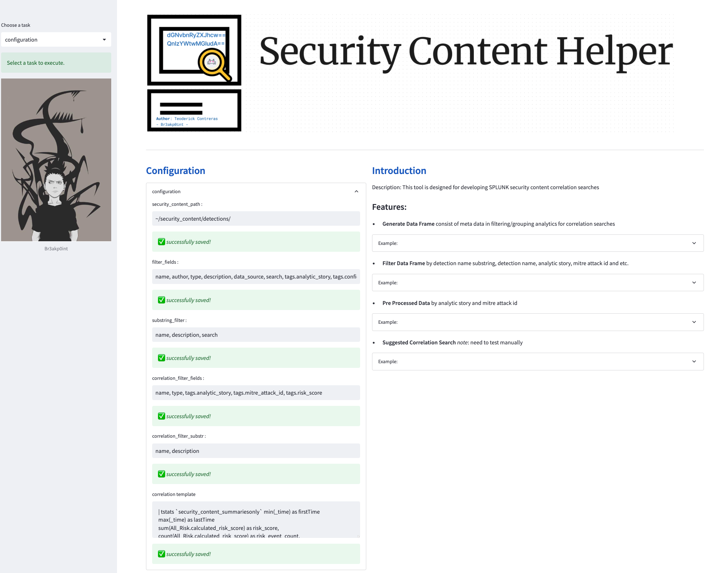
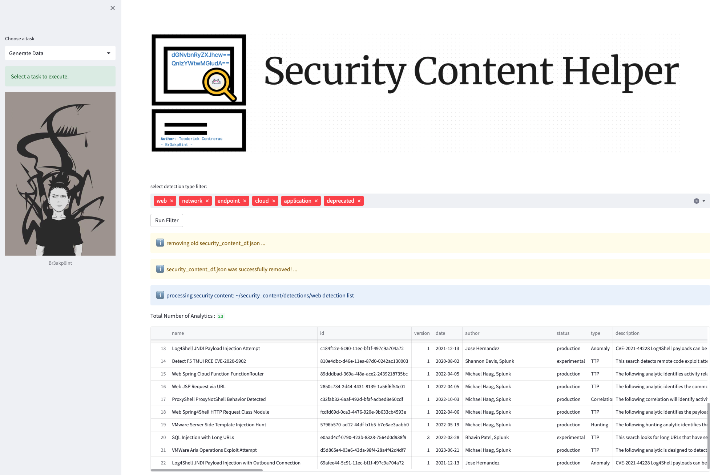
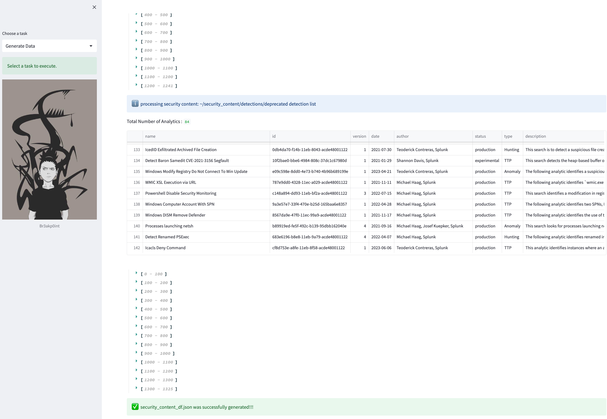
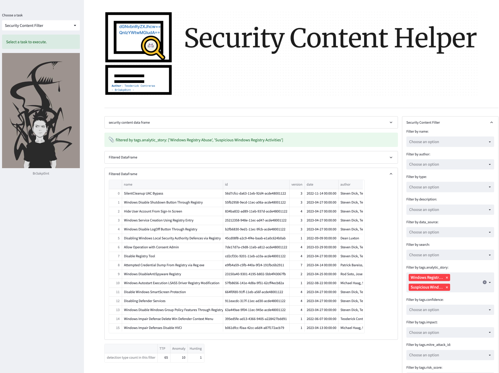
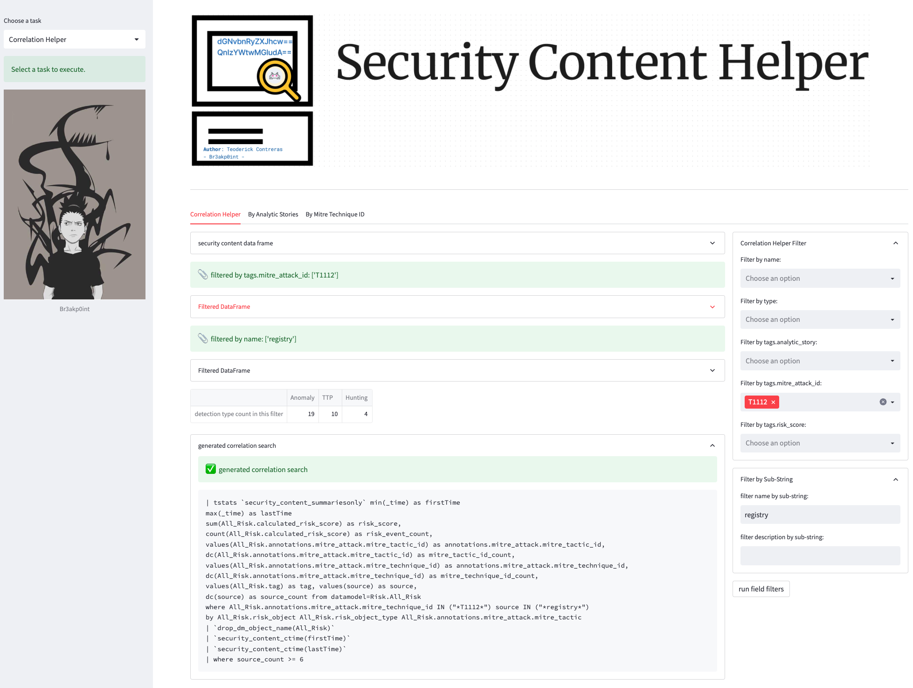
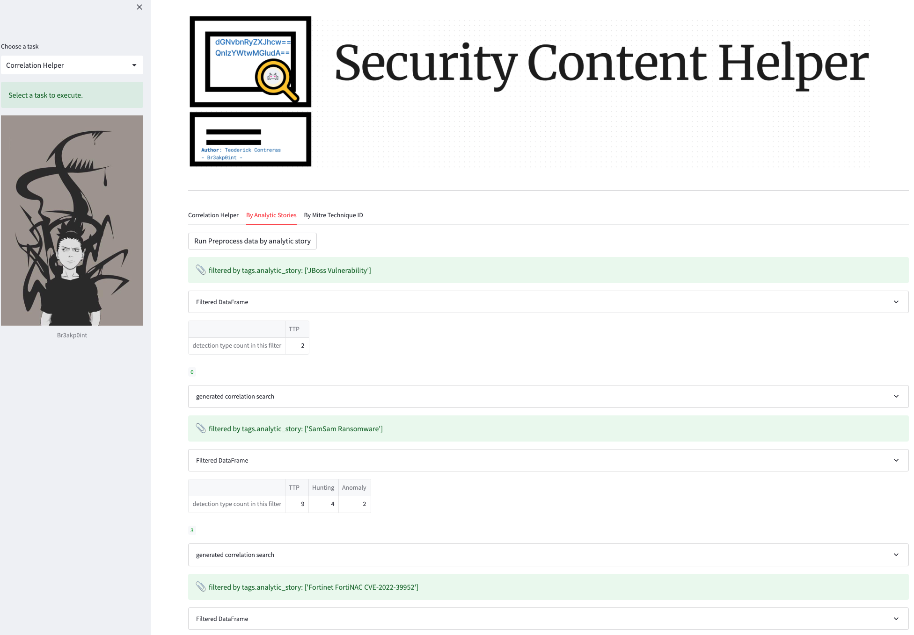

# Security-Content-Helper

 </img>


## Description:
<b>Security-Content-Helper</b> is a simple tool specifically designed to facilitate the filtering, analysis, and possible development of Splunk security content correlation searches bae on security content. It empowers security analysts by providing efficient data handling capabilities and enabling the creation of effective detection rules and correlations within the Splunk environment.


## Installation:
- Recommended to create a virtual environment to self-contained the dependencies of this project and to avoid conflict for your existing python settings

  - Instal virtual environment
  ```
  python -m pip install venv
  ```
  - Navigate to the directory where you want to create your virtual environment and run the command
  
  ```
  python -m venv myenv
  ```
  
  - activate the virtual environment
    
    Windows:
    ```
    myenv\Scripts\activate
    ```

    Mac/linux:
    ```
    source myenv/bin/activate
    ```
  - to deactive the virtual environment
    ```
    deactivate
    ```
- Install all required libraries or just use requirements.txt
  - using requirements.txt
    ```
    pip install -r requirements.txt
    ```
  - needed libraries:
    ```
    pip install streamlit
    pip install pandas
    pip install pyyaml
    pip install Pillow
    ```
## HowTo:

- git clone the project
  ```
  git clone https://github.com/tccontre/Security-Content-Helper
  ```
- run the application
  ```
  streamlit run security_content_helper.py
  ```

## Features:
### Configuration
Provide user-friendly access to key fields in the config.ini file, enabling users to easily modify and enhance its settings to suit their specific needs and optimize usage.

 </img>

```
- security_content_path     : the security content detections folder path
- filter_fields             : exposed security content detection yaml fields for filtering
- substring_filter          : exposed security content detection yaml fields for sub-string filtering
- correlation_filter_fields : exposed security content detection yaml fields for correlation search filtering and development
- correlation_filter_substr : exposed security content detection yaml fields for sub-string correlation search development and filtering
- correlation template      : experimental correlation search template
```

### Generate Data
Generate a comprehensive security content data frame that serves as the foundation for efficient data filtering and processing across various tasks within this tool.


 </img>

It will also generate <b>security_content_df.json</b> to create a structured dataset that can be utilized for various security-related tasks.

 </img>

### Security Content Filter
a feature to filter the security content by detection name, search, descriptions, analytic story, mitre attack id and etc

 </img>

### Correlation Search Helper 
<b><i>(this is only suggestion base on filter fields from security content. It still need manual testing and tuning)</i></b>

filtering feature that allows users to easily narrow down the security content based on specific fields, facilitating efficient correlation search development.

 </img>

### Pre-Processed Data
pre processed group of detections for correlation searches

 </img>


## Author
[Teoderick Contreras](https://twitter.com/tccontre18)
